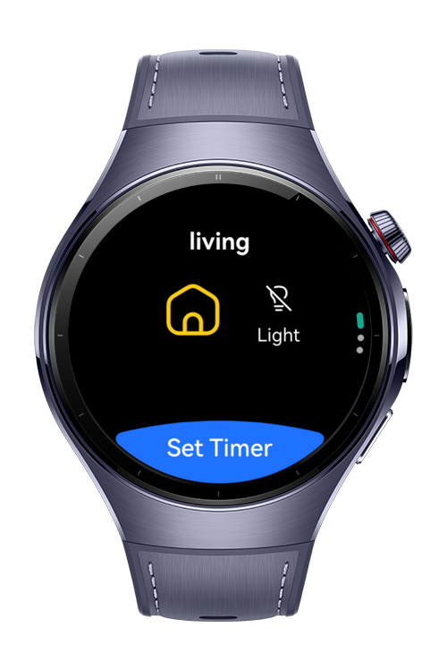
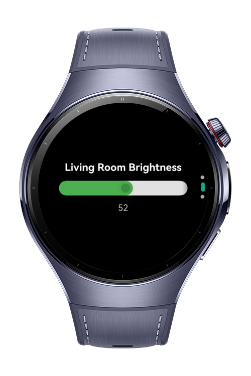
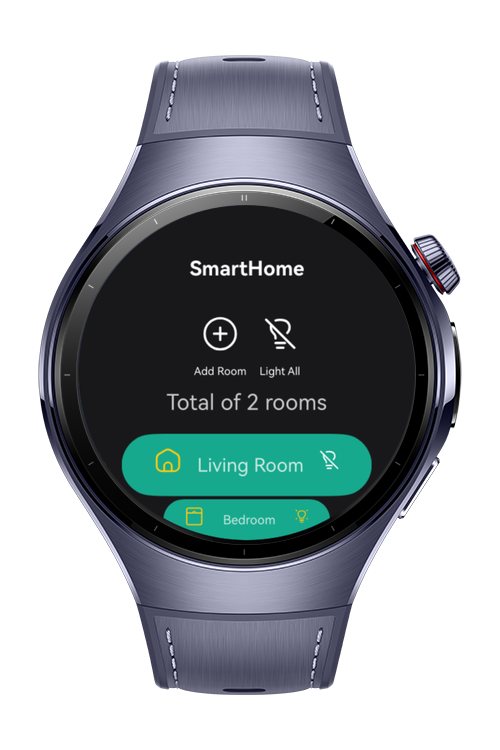

> **Note:** To access all shared projects, get information about environment setup, and view other guides, please visit [Explore-In-HMOS-Wearable Index](https://github.com/Explore-In-HMOS-Wearable/hmos-index).

# SmartHome

**SmartHome** - Control and automate room lights using your watch.
Create dynamic scenes, sync lights with music, set schedules, and manage multiple
bridges.


## Preview
<div>
  
  
  
  
</div>

## Use Cases

- Dynamic Light Effects
- Smart Switch
- Change Light Color
- Home Automation

## Tech Stack

- **Languages**: ArkTS, ArkUI
- **Frameworks**: HarmonyOS SDK 5.0.21
- **Tools**: DevEco Studio 5.1.0 Beta1
- **Libraries**: @kit.ArkUI

## Directory Structure

```
entry/src/main/ets/
├───components
│       AddSheetBuilder.ets
│       HeaderSheetBuilder.ets
│       IconContainer.ets
│       RoomBrightnessComponent.ets
│       RoomColorComponent.ets
│       RoomItemInfo.ets
│       RoomListItemComponent.ets
│       RoomNameComponent.ets
│       RoomToggleComponentBuilder.ets
├───entryability
│       EntryAbility.ets
├───entrybackupability
│       EntryBackupAbility.ets
├───pages
│       Index.ets
│       RoomItemPage.ets
├───store
│       RoomListActions.ets
│       RoomListReducer.ets
│       RoomListStore.ets
├───viewmodels
│       RoomItemModel.ets
│       RoomStoreModel.ets
└───views
        RoomItemView.ets
        RoomListView.ets
```

# Constraints and Restrictions
## Supported Device
- Huawei Watch 5

# LICENSE
**Smart Home** is distributed under the terms of the MIT License.
See the [license](LICENSE) for more information. 